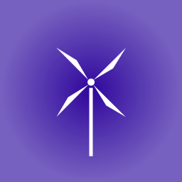

<div style="display: inline-flex; align-items: center;">
    
    <div style="margin: 0 0 0 30px;">
        <h1>Windmill</h1>
        <h2>Handling events on Python in a soft way</h2>
    </div>
</div>

---
## What is Windmill?
This project is a Python library that offers a more soft and minimalist way to handle events in your Python application. The main idea of Windmill is to provide a decoupled way to communicate a lot of parts of your code about events without creating any direct links or dependencies between isolated regions of code.

---
## The Features
This project currently supports the following features:
- Async event publishing
- Sync and async handlers (listeners)
- Priority level for events
- "once" execution for events
- Simple listeners subscription API and decorators

---
## How to install
You can install the library through `pip install` command:
```bash
pip install windmill
```

---
## How to use
Here is a little example of how to use this library in your project:
```python
# Here we import the library
from windmill.event_bus import EventBus,  Event

# It creates an instance of EventBus
bus = EventBus()

# Here we define an event listener
# We are saying that when the 'greet' event is emitted, then executes something. This listener receives the emitted event instance as parameter.
@bus.on('greet')
def hello(event: Event):
    print(f"Hello world, {event.payload}!")

# Here we publish the 'greet' event with the 'Bob' as payload (data)
bus.publish('greet', 'Bob')
```
The expected output for the code above is:
```
Hello world, Bob!
```

---
## Todos:
- [ ] Wildcard topics
- [ ] Retry/Backoff and DLQ
- [ ] Write unit tests
- [ ] Roles and permissions
- [ ] Payload validation
- [ ] Data persistence (json, db, etc.)
- [ ] Metrics and tracing system